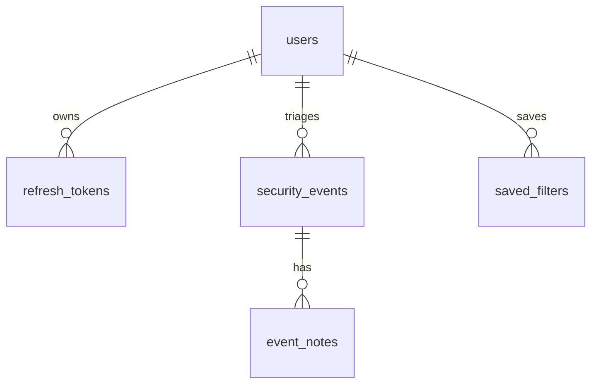

# SignalDesk Workspace

Public portfolio workspace for a Frontend / Product Engineer application.

## Repository topology

- Organization workspace: `https://github.com/signaldesk-labs/signaldesk-workspace`
- Personal mirror: `https://github.com/cyjoon68/signaldesk-workspace`
- App submodule: `https://github.com/signaldesk-labs/signaldesk-fe`
- API submodule: `https://github.com/signaldesk-labs/signaldesk-be`
- Default branch: `develop`
- `main` branch is retained.

## Implementation scope

- FE: React, TypeScript, `ky`, TanStack Query, D3, jQuery/Ajax compatibility, Playwright smoke test.
- BE: Python Flask RESTful API, module, MariaDB, Tortoise ORM, pytest, OpenAPI, k6.
- demo-backend conversion: auth/user/phone/token ideas converted to REST. GraphQL is not used.

## Local commands

```bash
git submodule update --init --recursive
cd signaldesk-fe && npm install && npm run build
cd ../signaldesk-be && python -m venv .venv && . .venv/bin/activate && pip install -r requirements.txt && pytest
```

## Screenshot


## API example

```http
GET /api/dashboard
PATCH /api/events/{event_id}/status
POST /api/auth/refresh
```

## ERD



## Verification

- `npm install && npm run build`: passed
- `npm audit --audit-level=critical`: passed, 0 vulnerabilities
- `npm run test:e2e`: passed, 1 Playwright smoke test
- `pip install -r requirements.txt && pytest`: passed, 2 tests
- Screenshot captured with Playwright
