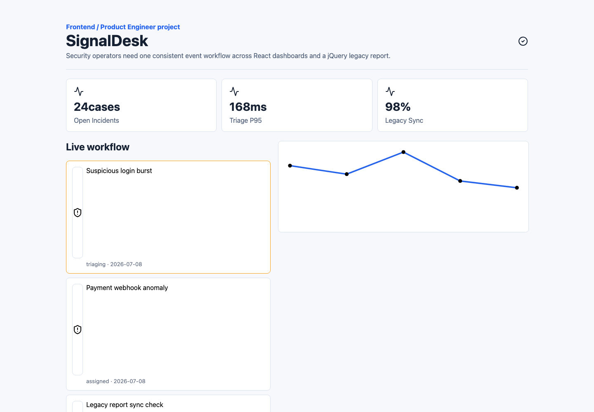

# SignalDesk Workspace


보안 이벤트 운영자가 이벤트 접수, 우선순위 확인, 상태 변경, 레거시 리포트 동기화를 한 흐름에서 처리할 수 있도록 만든 프로젝트입니다.

## 저장소 구성

- FE: [`signaldesk-fe`](https://github.com/signaldesk-labs/signaldesk-fe)
- BE: [`signaldesk-be`](https://github.com/signaldesk-labs/signaldesk-be)
- 개인 공개 미러: https://github.com/cyjoon68/signaldesk-workspace
- 기본 브랜치: `develop`

## 핵심 기능

- 보안 이벤트 목록과 처리 상태 확인
- 이벤트 상태 변경 워크플로우
- D3 기반 이벤트 추세 시각화
- jQuery/Ajax 레거시 리포트 연동 adapter
- Flask REST API와 MariaDB 기반 이벤트/토큰 데이터 관리

## 화면



## 기술 스택

- Frontend: React, TypeScript, ky, TanStack Query, D3, jQuery
- Backend: Python, Flask, Tortoise ORM
- Database: MariaDB
- Infra/Test: Docker Compose, OpenAPI, pytest, k6, Playwright

## 실행

```bash
git submodule update --init --recursive

cd signaldesk-fe
npm install
npm run dev

cd ../signaldesk-be
python3 -m venv .venv
. .venv/bin/activate
pip install -r requirements.txt
pytest
```

## 데이터 흐름

```text
React Dashboard
  -> ky client
  -> Flask REST API
  -> Tortoise ORM
  -> MariaDB
```
